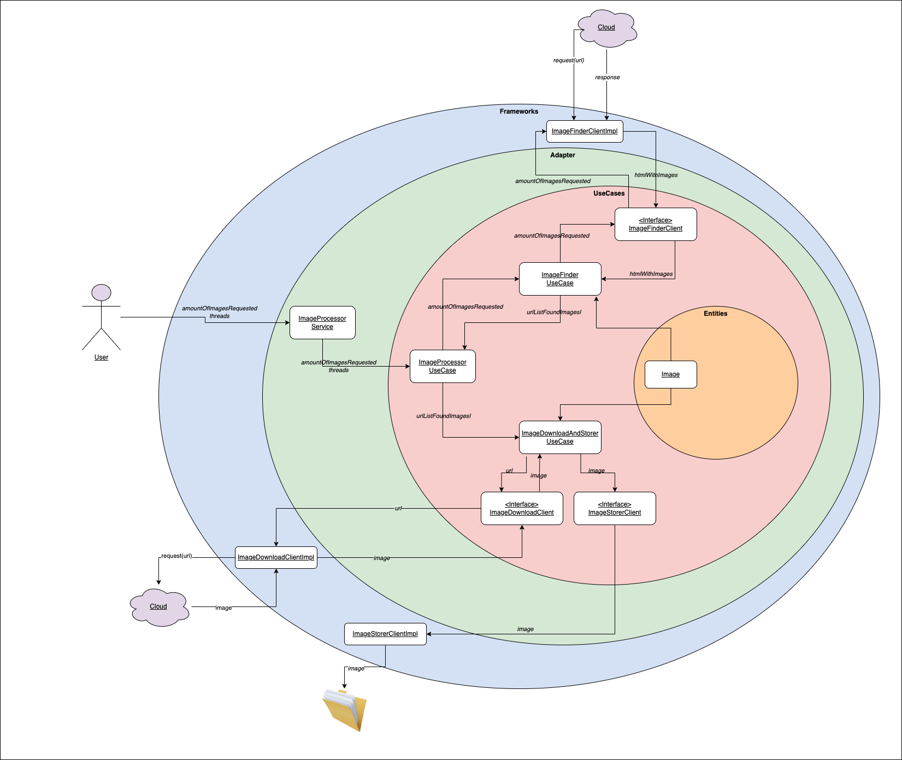

# Proper Take Home Exercise

```
Owner: Rodrigo Noblega
```


## Objective

Program to download images from http://icanhas.cheezburger.com/ and store them locally.


## Project structure

This project was structured based on the concept of [Clean Architecture](https://blog.cleancoder.com/uncle-bob/2012/08/13/the-clean-architecture.html) and following "The Dependency Rule" that says that source code dependencies can only point inwards. Nothing in an inner circle can know anything at all about something in an outer circle.

The implementation of this code was made using TDD (Test driven development), clean code and simple design.

Project structure diagram:



```
Note: I have the ImageFinderClient, ImageDownloadClient and ImageStorerClient as interface
inside UseCase layer and the implementations of those interface in the framework layer. I 
did this because, if in the future we want to change any implementation, I would only have
modify in one single place.
```

```
Note 2: I have an Instrumentation struct that handles logs. Nowadays I only print the error. 
If we want to add, for example, a tracking tool in order to register errors, 
we can do it here without modifying any business logic code.
```

```
Note 3: I have a configuration struct to instace the structs in order to follow the dependency
inversion principle.
```

## Considerations

- It is considered that it is not known how many images there are per page
- It is considered that the images have to be saved in the same order that is shown on the page


## Using the client

In order to use the program you should:

- Execute `go run main.go --threads={numberOfThreads} --amount={numberOfImages}`


## Test

The implementation was made following TDD (Test driven development).

Types of test:
* Unit Tests: Used to test packages individually
* Functional tests: Used to test the entire application flow

We can find a 100% of code coverage:


To run the test locally, you should run:

`go test -v -coverpkg ./... ./... -coverprofile cover.out` to run all the application's test

`go tool cover -html=cover.out` to see the code coverage report


## External libraries
* https://pkg.go.dev/github.com/PuerkitoBio/goquery --> To do web scraping/HTML parsing in Golang
* https://pkg.go.dev/github.com/stretchr/testify/mock --> To mock objects and verify calls are happening as expected


## Questions

* [rnoblega@gmail.com](rnoblega@gmail.com)
